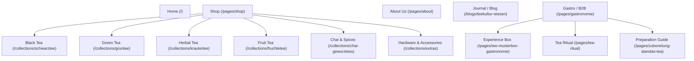
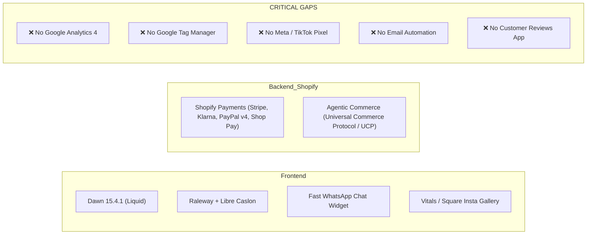

# Comprehensive 360° Site Audit & Commercial Teardown: Alandas.de

**Target:** [Alandas.de](https://alandas.de/)  
**Document Classification:** Pre-Engagement Client Dossier & Storefront Analysis  
**Prepared For:** Strategic Client Pitch & Project Scoping  

---

## 1. Executive Summary & Brand Profile

| Parameter | Details |
| :--- | :--- |
| **Brand Name** | **Alandas** (stylized as *Alanda's* / *Alandas Tea Berlin*) |
| **Store URL** | `https://alandas.de/` |
| **Shopify Backend Domain** | `biwzp1-gk.myshopify.com` |
| **Legal Entity** | Sole Proprietorship (*Einzelunternehmen* / Registered Gewerbe in Berlin-Charlottenburg) |
| **Founder / Legal Representative** | **Sidy Sow** |
| **Registered Address** | Lise-Meitner-Str. 39, 10589 Berlin, Germany (Gewerbehof near Jungfernheide) |
| **Direct Contact** | Website/WhatsApp: `+49 15678 689200` \| Email: `info@alandas.de`<br>*(Note: Google Maps lists mobile `+49 1515 6856439`)* |
| **Google Business Profile** | Verified as **"alanda's tea"** (5.0 ★, 2 reviews), registered as "E-commerce service" |
| **VAT ID (USt-IdNr)** | `DE312066015` |
| **Core Brand Tagline** | *"Bleib inspiriert – mit Tee, Trends und Geschichten, die verbinden."*<br>*(“Stay inspired – with tea, trends, and stories that connect.”)* |
| **Brand Concept & Story** | "Alandas ist anders" ("Alandas is different"). Positioned as a modern, culturally rooted tea brand bridging international heritage with urban lifestyle. Blends are named after global cultural capitals (Istanbul, Marrakech, Paris, Bombay, Berlin, Damascus, Manila, California, etc.). Handcrafted in small batches, emphasizing pure botanicals with no artificial additives or flavor enhancers. |
| **Dual Business Model** | **B2C:** Direct-to-Consumer loose-leaf tea and tea accessories.<br>**B2B:** Turnkey tea bar concepts for gastronomy (cafes, restaurants, boutique hotels). |
| **Active Social Proof** | **Google Maps:** 2x 5.0★ verified reviews.<br>**Homepage:** 3 static testimonials (Jasmin B., Marah A., Allen W.).<br>**Product Pages (PDPs):** Zero reviews or star rating widgets. |

---

## 2. Complete Site Architecture & Content Inventory

The store is built on Shopify using an updated copy of the **Dawn 15.4.1** theme. Below is the mapped structure and translated English content breakdown:

### Main Navigation & Site Map


### Core Pages & Editorial Breakdown (Translated to English)
1. **Home (`/`)**: Hero visual banner featuring Bombay Chai with milk, introducing the brand philosophy ("Alandas ist anders"), featured product carousels, B2B teaser for gastronomy, and an Instagram feed integration.
2. **About Us (`/pages/about` — *Unsere Geschichte*)**:
   - Narrative of a new generation with multicultural roots creating a sensory journey through tea.
   - Highlights gentle processing, small batches, and sustainability (reducing plastic waste, reusable containers).
3. **Gastronomy B2B Hub (`/pages/gastronomie`)**:
   - Pitches cafes and restaurants on replacing bag tea with a high-margin premium loose-leaf tea bar concept.
   - Margin calculation model: Cost per pot ~€0.25, menu price €4.50–€5.90, net profit ~€4.25–€5.65.
   - Social proof from 3 Berlin partners (*Cafe Lafemme*, *Restaurant Meyman*, *Hotel Grosskreutz*).
   - Low-friction order method: "Send a WhatsApp photo of your restock order."
4. **Gastro Sample Box (`/pages/tee-musterbox-gastronomie`)**:
   - Dedicated landing page for the "Tea Experience Box" (pot, tray, dosing spoon, 5–6 tea varieties).
5. **Tea Ritual (`/pages/tea-ritual`)**:
   - Visual education page focusing on mindfulness and visual aesthetics using transparent borosilicate glass.
6. **Preparation Guide (`/pages/zubereitung-alandas-tea`)**:
   - Dosing guidelines, water temperatures (70–80°C for green, 100°C for herbal/black), and infusion times.
7. **Journal / Knowledge Base (`/blogs/teekultur-wissen`)**:
   - *Article 1:* "Turkish Tea: Tradition, Preparation & Culture simply explained" (educational guide linking to the ISTANBUL Chai product).
   - *Article 2:* "Serving tea in gastronomy: How to succeed with the perfect tea bar concept for cafes & restaurants" (B2B lead generation guide).
8. **Contact Page (`/pages/contact`)**:
   - Inquiry form, direct WhatsApp link, and a sample pack order CTA.

---

## 3. Product Catalog & Commercial Breakdown (All 26 SKUs)

The catalog consists of **26 products** divided into three distinct segments:

### Category A: Cultural Destination Blends (Flagship 220g Doypacks)
*All flagship blends are priced at **€14.69** (€6.68 / 100g) unless noted.*

| Product Handle | Name & Cultural Inspiration | Key Ingredients & Flavor Profile | Specs & Format | Price |
| :--- | :--- | :--- | :--- | :--- |
| `istanbul-chai-zimt-apfel-rosen` | **ISTANBUL** (Turkish Chai) | Black tea, cinnamon, dried apple, rose petals. Spicy-floral with sweet apple. | 220g Loose | **€14.69** |
| `bombay-chai-latte-original` | **BOMBAY** (Indian Chai Latte) | Black tea, cardamom, cloves, cinnamon. Traditional Indian bazaar spice blend. | 220g Loose | **€14.69** |
| `marrakech-minztee-marokkanisch` | **MARRAKECH** (Moroccan Mint) | Green tea, peppermint, lemon peel, natural citrus aroma. Refreshing & cooling. | 220g Loose | **€14.69** |
| `paris-fruechtetee-erdbeere-hibiskus` | **PARIS** (French Patisserie Fruit) | Strawberries, apple, hibiscus, rosehip, cornflower petals, light cream note. | 220g Loose | **€14.69** |
| `berlin-rooibos-hanf-mate` | **BERLIN** (Urban Energy Infusion) | Rooibos, hemp, carrots, green mate, papaya. Tangy, earthy, energizing. | 220g Loose | **€14.69** |
| `damaskus-sencha-gruener-tee-blueten` | **DAMASKUS** (Levantine Floral Fusion)| Japanese Sencha, black tea, rose petals, sunflower petals, jasmine blossoms. | 220g Loose | **€14.69** |
| `london-schwarztee-karamell-vanille` | **LONDON** (English Afternoon Tea) | Black tea, rooibos, caramel pieces, vanilla, jasmine, mallow blossoms. | 220g Loose | **€14.69** |
| `california-rooibos-orange` | **CALIFORNIA** (West Coast Citrus) | Rooibos, orange peel, orange blossoms. Sunny, fruity, naturally caffeine-free. | 220g Loose | **€14.69** |
| `granada-fruechtetee-hibiskus` | **GRANADA** (Andalusian Garden) | Green tea, mint, orange peel, orange blossom, hibiscus. Tart and floral. | 220g Loose | **€14.69** |
| `manila-gruener-tee-tropisch` | **MANILA** (Tropical Archipelago) | Green tea, pineapple, papaya, apple, orange, marigold, rose. Exotic & fruity. | 220g Loose | **€14.69** |
| `schwarzwald-beerentee-hibiskus` | **SCHWARZWALD** (Black Forest Berries)| Cranberries, blackberries, raisins, hibiscus. Rich, tart berry infusion. | 220g Loose | **€14.69** |
| `himalaya-yogitee-ingwer-gewuerze` | **HIMALAYA** (Ayurvedic Chai) | Black tea, ginger, cardamom, cinnamon, cloves, black pepper, citrus hint. | 220g Loose | **€14.69** |
| `budapest-stevia-lemongras-tee` | **BUDAPEST** (Hungarian Herbal) | Lemongrass, apple chunks, ginger, stevia leaves, sunflower blossoms. | 150g Loose | **€10.20** |

### Category B: Single-Origin & Pure Classics
| Product Handle | Name | Profile & Origin | Specs & Format | Price |
| :--- | :--- | :--- | :--- | :--- |
| `earl-grey-blue-rukeri-bergamotte` | **EARL GREY BLUE** | Single-estate Rukeri black tea from Rwanda, bergamot oil, cornflower. | 220g Loose | **€14.69** |
| `gruentee-sencha-japanischer-tee` | **GRÜNTEE SENCHA** | Pure Japanese Sencha. Grassy, fresh, umami notes. | 220g Loose | **€14.69** |
| `schwarztee` | **SCHWARZTEE** | Classic Ceylon & Darjeeling blend (English Breakfast style). | 220g Loose | **€14.69** |
| `oolong` | **OOLONG SE CHUNG** | Semi-fermented blue tea from Fujian Province, China. Fruity-malty. | 220g Loose | **€14.69** |
| `kamille` | **KAMILLE** | Whole chamomile blossoms, uncrushed. Calming, floral. | 80g Loose | **€5.49** |
| `pfefferminze` | **PFEFFERMINZE** | Coarse-cut pure peppermint leaves. High menthol freshness. | 120g Loose | **€8.49** |

### Category C: Hardware, Teaware & B2B Packages
| Product Handle | Name | Description | Key Specs | Price / Status |
| :--- | :--- | :--- | :--- | :--- |
| `glass-jug` | **Glass Teapot with Stainless Lid-Filter** | Handcrafted borosilicate glass teapot with built-in lid strainer. | 350ml capacity, -40°C to +150°C | **€24.95** (In Stock) |
| `bambus-tablett` | **Bamboo Serving Tray** | Natural bamboo tray sized to hold the teapot and cup. | 22.5 × 14 × 2.5 cm | **€9.89** (In Stock) |
| `aufbewahrungsglas` | **Airtight Storage Jar** | Borosilicate glass jar with airtight bamboo lid. | 800ml (15 × 10 cm) | **€8.90** (In Stock) |
| `measuring-spoon` | **Stainless Steel Dosing Spoon** | Dosing spoon measured for 1 standard teapot (1 tsp). | 14 × 3.5 cm | **€3.90** (In Stock) |
| `teesieb-in-herzform` | **Heart-Shaped Strainer Spoon** | Stainless steel snap-mesh infuser for single cup brewing. | 14.3 × 4.3 cm | **€5.95** (In Stock) |
| `teebar-holzregal-mit-aufbewahrungsglaeser` | **Wooden Teabar Shelf + Jars** | 6-jar or 8-jar solid wood counter display for hospitality. | 27 × 35/46 × 28 cm | **€79.00** ⚠️ **OUT OF STOCK** |
| `gastro-testpaket` | **Tea Experience Box** | Trial starter kit: Teapot, bamboo tray, spoon, 5–6 teas. | Full starter kit | **€19.00** *(Discrepancy noted below)* |
The above content does NOT show the entire file contents. If you need to view any lines of the file which were not shown to complete your task, call this tool again to view those lines.

---

## 4. Technical Stack & Infrastructure Analysis



### 1. E-Commerce Platform & Theme
- **Shopify Core:** Clean, fast Shopify native architecture (`biwzp1-gk.myshopify.com`).
- **Theme:** Modified version of Shopify Dawn (v15.4.1). Lightweight, responsive, and adheres to basic Shopify design conventions.
- **Font Stack:** Google Fonts via Shopify CDN: `Raleway` (modern sans-serif for body copy) and `Libre Caslon Text` (classic serif for headings).
- **Color Styling:** Rich, earthy luxury aesthetic: Warm Cream (`#fffbec`), Saffron Yellow (`#f0bb0c`), Deep Crimson (`#8d0004`), Forest Green (`#094832`), Terracotta (`#e05535`).

### 2. Installed Integrations & Apps
- **Fast WhatsApp Chat (`fast-whatsapp-chat-44`):** Direct communication floating widget linking to `+49 15678 689 200`. Very effective for quick B2B inquiries and local cafe support.
- **Square Instagram Feed / Vitals (`insta-feed-gallery.sqa-api.com` / `cdn-sf.vitals.app`):** Renders the Instagram photo grid on the homepage from `@alandastea`.
- **Payment Gateways:** Full suite enabled — Apple Pay, Google Pay, Shop Pay, PayPal v4, Klarna (Slice it / Pay Later), Credit Cards (Visa, Mastercard, Amex, Maestro, UnionPay).
- **Emerging Protocol Support:** Contains Shopify's native **Universal Commerce Protocol (UCP)** endpoints (`/agents.md` and `/.well-known/ucp`), enabling AI shopping agents to discover and browse the store.

### 3. Critical Technical & Marketing Gaps
> [!WARNING]
> ### Blocker Deficiencies in Current Setup
> 1. **Zero E-Commerce Analytics:** Neither Google Analytics 4 (`G-XXXXXXXXXX`) nor Google Tag Manager (`GTM-XXXXXX`) is installed. The client cannot see traffic sources, bounce rates, drop-off stages in the checkout funnel, or user behavior.
> 2. **Zero Paid Ad Attribution:** No Meta Pixel (`fbq`), TikTok Pixel, or Pinterest Tag is installed. Running ads in this state results in blind spending with no conversion feedback or retargeting audiences.
> 3. **No Retention / Email Marketing Engine:** The site only has a basic Dawn newsletter form saving emails to Shopify's default customer list. There is no automated welcome flow, abandoned cart recovery sequence, or re-order automation.
> 4. **Product Page Review Void (The Social Proof Disconnect):** While the homepage features 3 static text quotes (Jasmin B., Marah A., Allen W.) and Google Maps has two 5-star reviews, there is **zero review application on individual Product Detail Pages (PDPs)**. There are no star ratings, no "Verified Buyer" badges, no photo UGC, and no `AggregateRating` schema to trigger Google search rich snippets.
> 5. **Google Business Profile Misconfiguration:** The business is verified under **"alanda's tea"** (5.0★, 2 reviews), but is registered as an "E-commerce service" with a hidden street address. This drops the Google map pin in the center of Germany instead of Berlin, rendering Alandas invisible to Berlin cafe owners searching locally for tea suppliers. Furthermore, the listed phone (`+49 1515 6856439`) does not match the website's WhatsApp number (`+49 15678 689200`).
> 6. **Broken Schema.org Data:** The JSON-LD `Organization` schema outputs multiple empty string items `""` in the `sameAs` array for unfilled social handles, failing structured data validation.
> 7. **Insecure Protocol in Head:** The Instagram link in the page header is hardcoded as `http://instagram.com/alandastea` instead of `https://`.

---

## 5. Viewpoint Analysis: B2C vs B2B Customer

### A. The B2C (Retail Consumer) Viewpoint

```
Customer Persona: Urban tea enthusiast, wellness seeker, gift shopper, aesthetic conscious.
Average Order Value: ~€15 - €35
```

#### What Works Well:
- **Evocative Branding:** Blends like *Paris*, *Istanbul*, *Marrakech*, and *Berlin* create instant sensory appeal. The concept of "cities in a cup" feels distinct from bland supermarket teas.
- **Ingredient Quality:** Transparent botanical ingredients (e.g. real strawberries in *Paris*, whole chamomile blossoms, real bergamot on Rwanda Rukeri in *Earl Grey Blue*).
- **Aesthetic Photography:** Clear visuals showcasing the vibrant dry leaves and the clarity of the brewed infusion.
- **Payment Flexibility:** Shop Pay, Apple Pay, and PayPal offer frictionless 1-click purchasing.

#### What Causes Friction & Lost Sales:
1. **Total Absence of Reviews & Social Proof:** A customer paying €14.69 for a single bag of tea from an unknown brand expects social validation. Having zero star ratings or reviews on product pages creates massive hesitation.
2. **Confusing Shipping Thresholds:**
   - On every product page under "Versand": **"Versandkostenfrei ab 59 €"** (Free shipping over €59, otherwise €5.90).
   - On the official Shipping Policy page: **"Ab 40 Euro Warenwert Versandkostenfrei"** (Free shipping over €40, otherwise €5.95).
   - *Impact:* A customer ordering €45 worth of tea who is hit with shipping at checkout will feel cheated and abandon their cart.
3. **No Trial / Sampler Sizes:** All flavored teas come in single 220g pouches (€14.69). A consumer wanting to try multiple flavors must spend >€44 for nearly 700g of tea. There is no B2C Discovery Box (e.g. 4x 30g sampler).
4. **Restricted Geographic Reach:** Shipping is strictly limited to Germany and Austria. European tea lovers in Switzerland, France, Netherlands, or the UK cannot order.
5. **No Gifting Bundles:** The natural match for this brand is gift-giving (e.g. "Teapot + Tray + Istanbul Chai Gift Set"), but no bundled sets exist for retail consumers.

---

### B. The B2B (Gastronomy / HoReCa) Viewpoint

```
Customer Persona: Cafe owner, breakfast brunch restaurant manager, boutique hotelier.
Average Order Value: €150 - €1,000+ recurring
```

#### What Works Well:
- **Speaks the Operator's Language:** The Gastronomie page nails the business pitch: tea in most cafes is treated as an afterthought (cheap tea bag in warm water for €3.80), whereas loose tea on a dedicated bamboo tray with a transparent pot commands €5.50+ with 90%+ gross margin.
- **The Turnkey Serving Concept:** Combining the borosilicate teapot (with lid strainer), custom bamboo tray, and precise dosing spoon solves operational complexity for cafe staff (takes only 90 seconds, no messy strainers to clean at the table).
- **Direct WhatsApp Line:** Cafe owners are on their feet all day; being able to message the founder directly on WhatsApp (`+49 15678 689 200`) fits hospitality workflows.

#### What Causes Friction & Lost Deals:
1. **Critical Contradiction in Sample Box Pricing:**
   - On the **Gastronomie page** and product page: **€19.00** (refundable on first order).
   - On the **Contact page**: **"Nur 9,90 € netto inklusive Versand"** (€9.90 net including shipping).
   - *Impact:* A prospective cafe partner comparing these pages immediately sees sloppy management and price inconsistency.
2. **Key B2B Hardware is OUT OF STOCK:**
   - The **Teebar Wooden Shelf with Storage Jars** (`teebar-holzregal-mit-aufbewahrungsglaeser`) is marketed as the visual centerpiece and selling display for cafes. However, both the 6-jar and 8-jar variants are marked **Unavailable / Out of Stock** in the system. A cafe ready to launch cannot buy the display unit.
3. **Unstructured Wholesale Ordering:**
   - The ordering procedure is currently described as: *"Send a WhatsApp photo of your desired varieties -> Invoice -> Delivery in 2-3 days."* While charming for indie cafes in Berlin-Kreuzberg, multi-unit operators, hotel chains, and corporate purchasing departments require formal purchase orders, automated net-price accounts, volume tiers, and proper B2B invoices.
4. **No Digital Bulk Tier Pricing:**
   - Wholesale volume rates (e.g., 1kg or 5kg catering refill bags) are not visible online. They are locked behind a manual PDF catalog request.
5. **Sole Proprietorship Optics:**
   - Listed in the Impressum as an *Einzelunternehmen* (Sidy Sow) rather than a registered entity (GmbH/UG). Larger hotel procurement departments frequently require HACCP compliance certificates, commercial register entries, and corporate credit checks.

---

## 6. Critical Inconsistencies & Storefront Glitches Found

| Issue | Location A | Location B | Problem & Solution |
| :--- | :--- | :--- | :--- |
| **Shipping Free Threshold** | Product Descriptions: **€59.00** | Shipping Policy Page: **€40.00** | Causes cart abandonment. Needs to be standardized at €49 across theme settings and policy text. |
| **Gastro Sample Box Price** | Gastro Page: **€19.00** | Contact Page: **€9.90 netto** | Price discrepancy alienates wholesale leads. Standardize at €9.90 netto credited against first order. |
| **Phone Number Mismatch** | Website / WhatsApp: **+49 15678 689200** | Google Maps: **+49 1515 6856439** | Incoming Google calls don't route to WhatsApp Business. Synchronize numbers across channels. |
| **Google Maps Pin & Category** | Registered in **Berlin (10589)** | Google Maps Pin: **Central Germany** | Registered as SAB without address; add Berlin/Potsdam service area & *Tee-Großhändler* category. |
| **Teebar Shelf Out of Stock** | Gastro Hero copy: *"Teebar als Blickfang"* | PDP: `Available: False` (€79.00) | Centerpiece B2B asset cannot be ordered. Update inventory or enable backorders. |
| **Social Media URLs in Schema** | JSON-LD `sameAs` array | Dawn Theme Social Settings | Dawn outputs empty strings `""` for unfilled social channels, causing Schema markup errors. |
| **Insecure Instagram Protocol** | Header `<link>` / `<script>` | Global Header Asset | Hardcoded `http://` triggers mixed-content warnings on modern browsers. Update to `https://`. |

---

## 7. Strategic Growth Blueprint: What to Pitch the Client

When speaking with Sidy Sow, positioning yourself as someone who has already diagnosed their revenue bottlenecks and prepared modern solutions will immediately win his trust. Here is the exact roadmap:

### Phase 1: Immediate Triage, Social Proof & Google Sync (Week 1)
- **Fix Discrepancies:** Standardize shipping thresholds (€49 unified threshold) and resolve the €9.90 vs €19.00 sample box pricing.
- **Synchronize Google Business Profile:** Set Berlin/Potsdam service areas, add *Tee-Großhändler* category, and route the Google phone number to WhatsApp Business.
- **Inventory Update:** Enable a "Pre-order for your venue" CTA on the B2B Teebar shelf.
- **Install Reviews & Social Proof:** Deploy Judge.me or Loox. Import Jasmin B., Marah A., and Allen W. plus Google reviews as verified seed reviews on product pages.

### Phase 2: Technical Tracking & Retention Setup (Week 2)
- **Implement GA4 & GTM:** Set up standard e-commerce events (`view_item`, `add_to_cart`, `begin_checkout`, `purchase`).
- **Implement Meta Pixel & CAPI:** Enable conversion tracking to prepare for Instagram/Facebook ads.
- **Integrate Klaviyo / Retention Automation:**
  - *B2C Welcome Flow:* 10% off first order + guide to loose-leaf tea.
  - *Abandoned Cart Flow:* 3-step recovery highlighting the sensory ritual.
  - *Post-Purchase Flow:* Brewing guide and temperature tips.
  - *Replenishment Reminder:* Triggered 45 days after purchase.

### Phase 3: Organic Social Funnel & AI Content (Weeks 3–4)
- **Deploy OpenReply (Self-Hosted Comment-to-DM Engine):**
  - Convert Instagram traffic from `@alandastea` directly into sales without expensive ManyChat fees.
  - Post Reels with comment triggers: *"Comment 'CHAI' for our autumn recipe + 10% off"* or *"Comment 'GASTRO' for the cafe sample box"*.
- **Integrate OpenChatCut (Agentic Video Editor via MCP):**
  - Batch-edit aesthetic 9:16 vertical Reels from Sidy's raw brewing footage using AI agents.
- **Launch a B2C Discovery Sampler Set:** Create a "World Tour" Box (5x 30g pouches + heart strainer) for €19.90 to lower first-purchase barrier.

### Phase 4: Scaled B2B Wholesale Engine (Weeks 5–6)
- **Dedicated B2B Wholesale Portal:**
  - Create a clean B2B registration form with instant approval for tax-ID verified businesses.
  - Show tiered wholesale pricing for 1kg refill bags and hardware bundles.
  - Provide downloadable digital assets for cafes (printable table tents, QR-code menu cards, barista brew guides).
- **Internationalization (English Storefront):**
  - Enable Shopify Markets with English translation. The brand names (*London*, *Paris*, *Bombay*, *Manila*) have natural international appeal for European expats and tourists who want Berlin boutique tea.